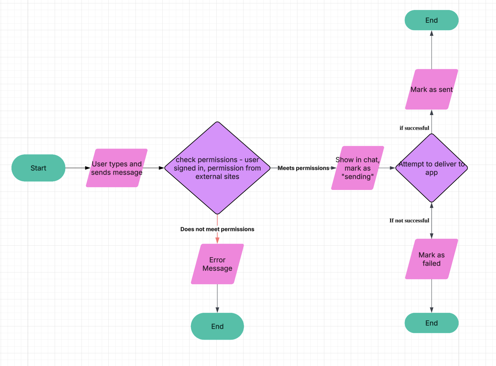
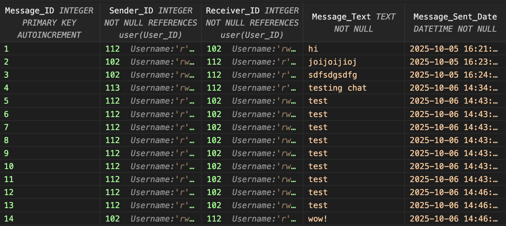

# APP Design Project

## Project Description and Requirements

### Project Description

A unified communication platform designed to integrate all major messaging services into one single interface, maximising efficiency.  

### Project Requirements

| Functional                            | Non-Functional                   |
| --------------------------------------| ---------------------------------|
| Allow users to login and sign up      | Load messages sent under 1 second|
| Allow users to send messages          | Easy to navigate                 |
| User account management               | Compatibility                    |

## Website Designs

### Inside the Page

### Sign in Page

### Log in Page

## Alternative Designs

### Inside the Page

### Sign in Page

### Log in Page

## Algorithms

### Functional Requirement

Sending Messages

### Test Case 1

Test Case ID: TC001

Test Case Name: Successful Message Sent

Preconditions: User is signed in, external platform is connected and permissions granted, internet connection active

Test Steps:

    1. User selects Discord
    2. User types "hello"
    3. Checks if user is signed in and permission granted from Discord
    4. Mark as "Sending" in chat
    5. Delivers message to Discord
    6. Message status changes to "Sent"

Expected Result: Message delivered and received successfully, message status shows as "Sent"

Priority: High

### Test Case 2

Test Case ID: TC002

Test Case Name: Unsuccessful Message Sent

Preconditions: User is signed in, external platform is connected and permissions not granted, internet connection active

Test Steps:

    1. User selects Discord
    2. User types "hello"
    3. Checks if user is signed in and permission granted from Discord
    4. Show error message due to permissions being not granted

Expected Result: Error message is displayed: "You do not have permission to send through this platform." Message is not sent or shown in chat.

Priority: High

## Database Structure and Test Data

### User

### Messages

### SQL Queries Examples

1. `SELECT * FROM messages WHERE Conversation_ID = 1;`

2. `SELECT * FROM messages WHERE User_ID is 1;`

3. `SELECT * FROM messages WHERE Message_Sent_Date='2025/07/20';`

4. `SELECT * FROM messages WHERE Message_Text='Digitized';`

5. `SELECT * FROM user WHERE Username='mspringtorp1a';`

## Web App Prototype 1 
As of Week 9

### Login Page

### Signup Page

### Messages Page

## Web App Prototype 2
As of Week 10
