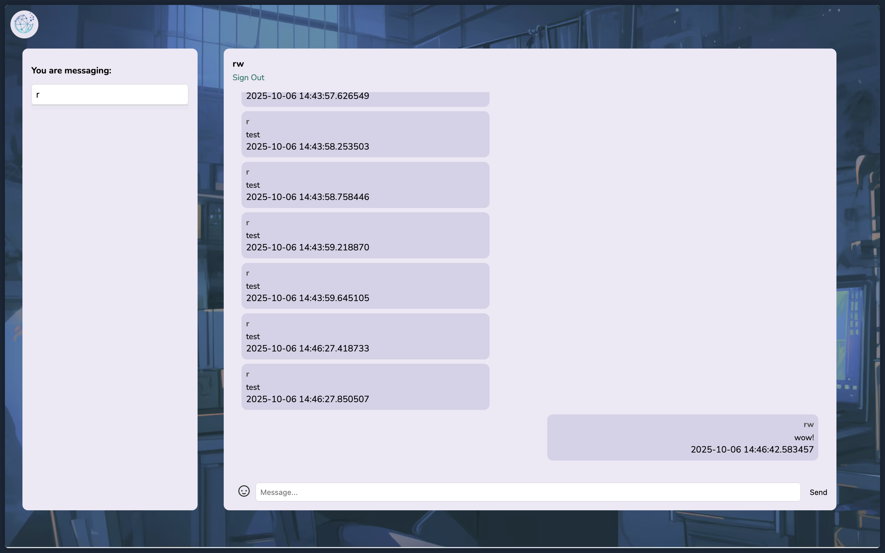

# APP Design Project

## Project Description and Requirements

### Project Description

A unified communication platform designed to integrate all major messaging services into one single interface, maximising efficiency.  

### Project Requirements

| Functional                            | Non-Functional                   |
| --------------------------------------| ---------------------------------|
| Allow users to login and sign up      | Load messages sent under 1 second|
| Allow users to send messages          | Easy to navigate                 |
| User account management               | Compatibility                    |

## Website Designs

### Inside the Page


### Sign in Page


### Log in Page


## Alternative Designs

### Inside the Page


### Sign in Page


### Log in Page


## Algorithms

### Functional Requirement

Sending Messages


### Test Case 1

Test Case ID: TC001

Test Case Name: Successful Message Sent

Preconditions: User is signed in, external platform is connected and permissions granted, internet connection active

Test Steps:

    1. User selects Discord
    2. User types "hello"
    3. Checks if user is signed in and permission granted from Discord
    4. Mark as "Sending" in chat
    5. Delivers message to Discord
    6. Message status changes to "Sent"

Expected Result: Message delivered and received successfully, message status shows as "Sent"

Priority: High

### Test Case 2

Test Case ID: TC002

Test Case Name: Unsuccessful Message Sent

Preconditions: User is signed in, external platform is connected and permissions not granted, internet connection active

Test Steps:

    1. User selects Discord
    2. User types "hello"
    3. Checks if user is signed in and permission granted from Discord
    4. Show error message due to permissions being not granted

Expected Result: Error message is displayed: "You do not have permission to send through this platform." Message is not sent or shown in chat.

Priority: High

## Database Structure and Test Data

### User


### Messages


### SQL Queries Examples

1. `SELECT * FROM messages WHERE Conversation_ID = 1;`

2. `SELECT * FROM messages WHERE User_ID is 1;`

3. `SELECT * FROM messages WHERE Message_Sent_Date='2025/07/20';`

4. `SELECT * FROM messages WHERE Message_Text='Digitized';`

5. `SELECT * FROM user WHERE Username='mspringtorp1a';`

## Web App Prototypes

### Prototype 1
As of Week 9

#### Login Page


#### Sign Up Page


#### Messages Page


### Prototype 2
As of Week 10

#### Login Page


#### Sign Up Page


#### Messages Page



## Lighthouse Reports

### Report #1


### Report #2

Changed image format from png to avif. Ran test without chrome extensions.


## Adding Interactivity

### Login and Signup Functionality

#### Features:
- **Signup**: Users create an account through a unique username and password
- **Login**: Users can login through a registered account
- **Validation**: System validates information provided by user
- **Password Security**: Passwords are hashed using `werkzeug.security` for security

#### How It Works

##### Signup Process:
1. The user enters a unique username and password on the signup page.
2. The system checks if the username already exists in the database.
3. If the username is unique:
   - The password is hashed and stored in the database.
   - The user is redirected to the login page with a success message.
4. If the username already exists:
   - The user is shown an error message.

##### Login Process:
1. The user enters their username and password on the login page.
2. The system checks if the username exists in the database.
3. If the username exists:
   - The entered password is compared with the hashed password stored in the database.
   - If the password matches, the user is logged in and redirected to the messaging page.
   - If the password does not match, an error message is shown.
4. If the username does not exist:
   - An error message is shown.

#### Important Code Examples

##### Signup Route (`main.py`)

```
@app.route("/signup.html", methods=["GET", "POST"])
def signup():
    if request.method == "POST":
        username = request.form["username"]
        password = request.form["password"]
        if dbHandler.create_user(username, password):
            flash("Signup successful! Please log in.", "success")
            return redirect(url_for("login"))
        else:
            flash("Username already exists. Please try a different one.", "danger")
    return render_template("signup.html")
```

##### Login Route (`main.py`)

```
@app.route("/login.html", methods=["GET", "POST"])
def login():
    if request.method == "POST":
        username = request.form["username"]
        password = request.form["password"]
        if dbHandler.verify_user(username, password):
            session["username"] = username
            flash("Login successful!", "success")
            return redirect(url_for("messages"))
        else:
            flash("Invalid username or password. Please try again.", "danger")
    return render_template("login.html")
```
#### Database Schema

The following information is stored in the `user` table:

| Column Name             |Data Type| Description                     |
|-------------------------|---------|---------------------------------|
| `User_ID`               | INTEGER | Auto-incrementing primary key.  |
| `Username`              | TEXT    | Unique username.                |
| `Password`              | TEXT    | Hashed password.                |
| `Account_Creation_Date` | DATE    | Account creation date.          |